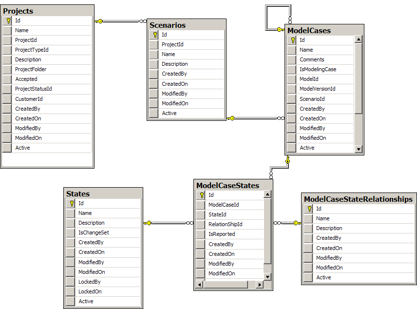
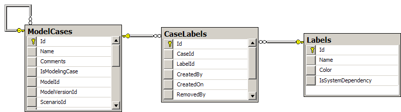
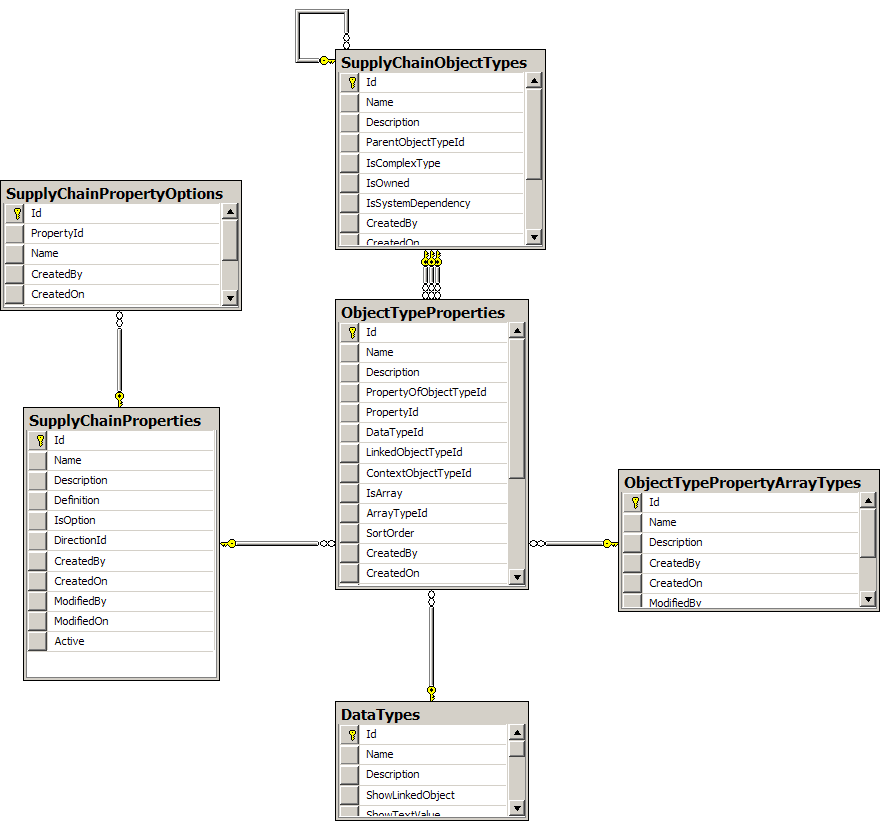
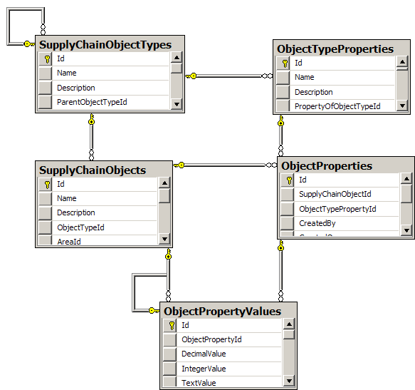
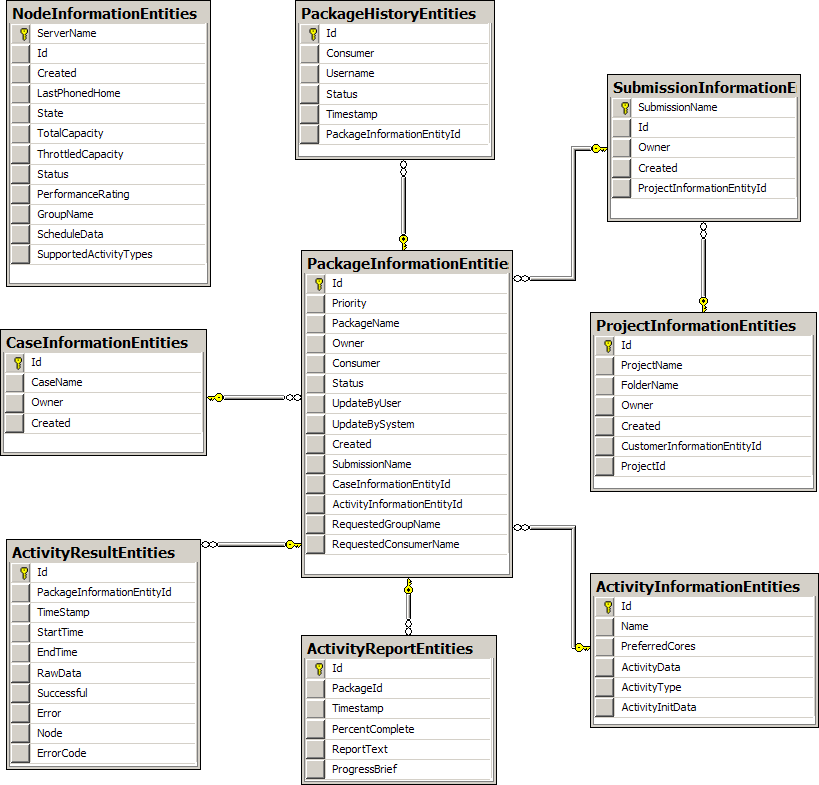

### AMS data model

#### Assumption Hierarchy

Assumptions are organized using a hierarchy with a Project at the top of the hierarchy.

Projects contain scenarios, scenario contains cases and each case has one Project state.

<!--  -->

> The relationship between case and state is implemented using linking table.
> This was originally implemented to allow for multiple so called "output states" to be linked to a case as well as a single input state.  Output states were supposed to hold selected model run results and AMS should have allowed for a comparison of model inputs and outputs.
> Project entity references a customer. This information is used for reporting in Runs Controller.
> Case (Model Case) entity can be associated with multiple Labels. Case labels are used in AMS for filtering and they also defined data retention policy used for case model outputs.

<!--  -->

The State entity represents a collection of objects with values that are used as a model input.

Objects and their values in a state are organized using a type system.

##### Type system data model

<!--  -->

Object type has a list of object type properties.

Each object type property references a property (supply chain property).

Supply chain property represents a well-known term that is re-used for multiple object types – for example "Net rate" is a well-known term used for all object types describing types of equipment.

Some properties may only have values from a defined set - enumeration. These are called options.

Object type property defines which properties can be used for particular object type, what is the unit of measure (if any) and what is the data type of its values.
Of object type property represents an array (of objects), it also references array type – there are two array types – homogeneous and heterogeneous.

AMS data model also supports object type inheritance – one object type can be used as a "parent" of another object type.

Derived object types then "inherit" object type properties of their parent.

Objects are instances of Object Types and Values are instances of Object type properties:

<!--  -->

For example Car Dumper 1 and Car Dumper 2 (objects) are instances of object type car dumper.

Net rate of Car dumper 1 (value) is an instance of Car dumper net rate (object type property).

As you can see in the diagram above, there is another entity sitting in between object type property and value – object property.

The original intention was to have this property representing now-abandoned concept of "contexts". Originally, objects could reference each object type property multiple times – each time in different context. Each of these references was represented with one object property record. I the current solution these contexts were replaced by having multiple object type properties.

Types of values:

* Atomic values – strings, integers, decimals and property option references (enumeration values)
* Object links (either a reference to not-owned top-level object or a link to nested owned object)
* Array headers
* Array elements – elements reference their header and store element index within the array; all array elements are object links (AMS does not support arrays of atomic values)

The existence of object link and array values enables for values to be organized into deep hierarchies.

### Runs Controller data model

Following diagram displays main entities of the Runs Controller data model:

 

**Package** information entity (package) represents a unit of execution.

Packages are grouped into submissions.

**Submission** must reference a **project**.

> You can see that this basic hierarchy really duplicates part of AMS data model. That's because Runs Controller existed before AMS and was designed to provide basic grouping for model executions (packages). AMS design adopted this structure.

**Package History** records changes in the packages status - when the package was created, when the execution started, when it was cancelled and re-started.

**Case** was added after AMS was created with the intention to provide easier connection between AMS and Runs Controller data but it **was never used**.

**Activity Report** table contains reports generated by running package. It usually contains standard output from the package executable.

**Activity Result** table records package execution results. It is important to note that single package can have multiple results - this happens if package is re-starter.

**Node** record represent a execution server (runs controller client instance). Nodes are loosely (no foreign key) referenced by package results.