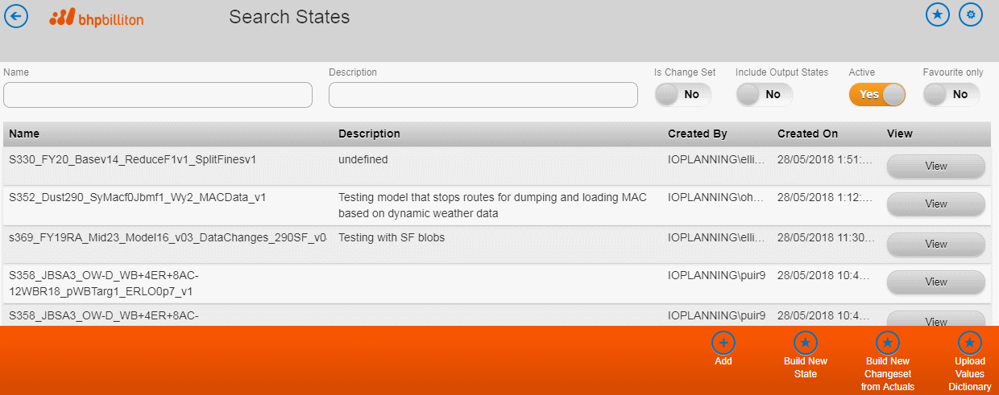
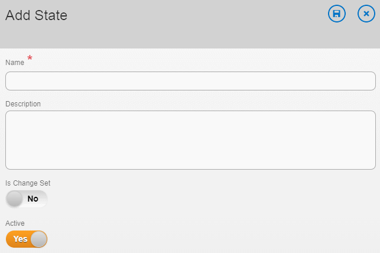
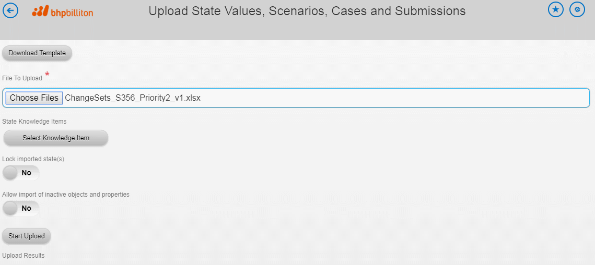
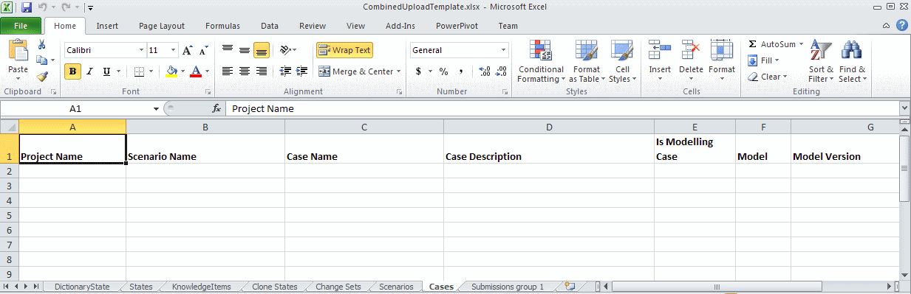
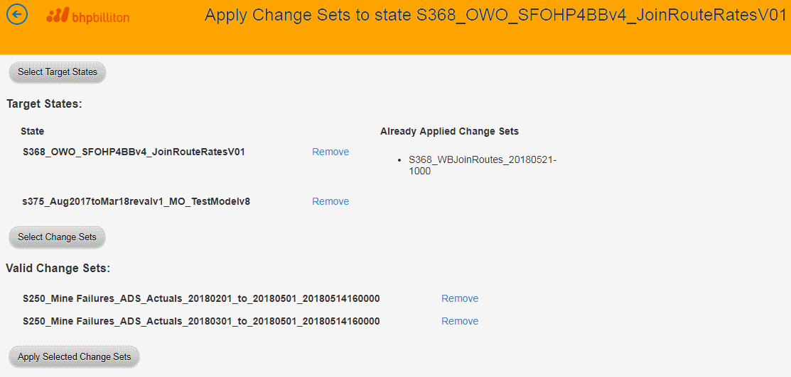
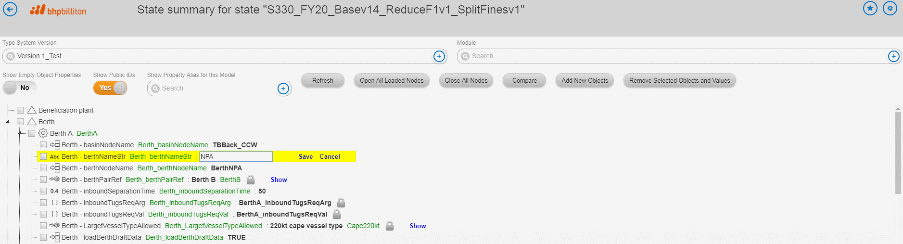
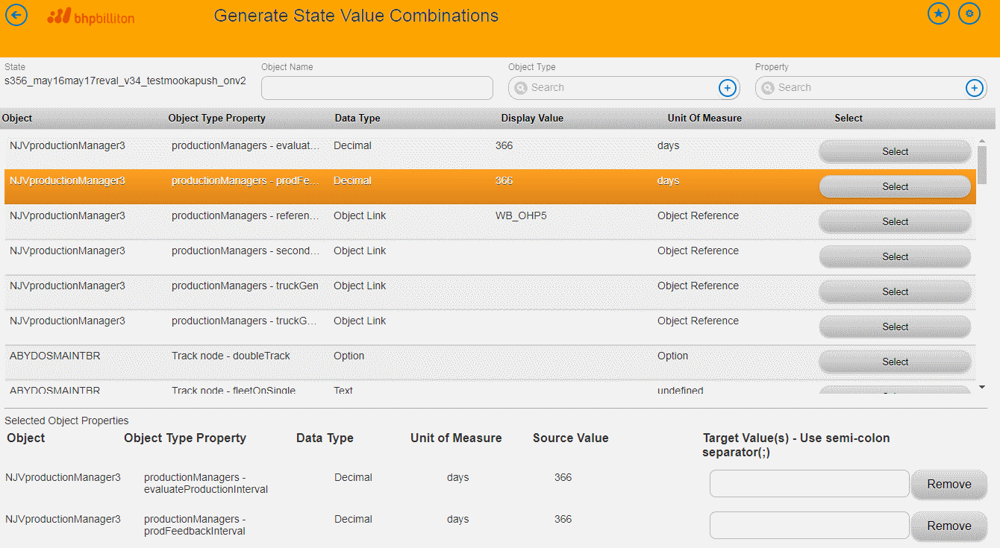
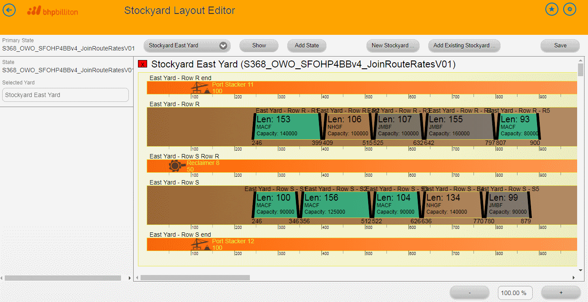

<!-- # Hidden by Structurizr -->
<!-- ## Also hidden by Structurizr -->

### AMS Functional Overview

The main function of AMS is to manage and allow for editing of model inputs and to allow user to create (P2C) submissions.

Values, that are used as model inputs, are organized into a structure called **state**.

States are used as input states for cases. **Case** (model case) binds together an input state and model version. Users create submissions for cases - they specify model run configuration (submission parameters) and number of seeds (packages) in the submission.

Cases are further grouped into **scenarios** and scenarios are grouped into **projects**.

To summarize this hierarchy:

* projects have many scenarios
* scenarios have many cases
* case has one input state
* case has one model version
* case has one or more model submissions (usually one)
* submission has many seeds (packages)

#### Management and editing of model inputs

AMS provides browse and edit screens for all entities of the hierarchy as listed above.

<!--  -->

<!--  -->

Users can create instances of all these entities "manually" using edit screens or they can upload their definitions using Excel spreadsheet upload.
States can be also upload from Excel spreadsheet.
Excel spreadsheet upload also allows user to create model submissions.

<!--  -->

<!--  -->

AMS supports a special kind of state - **change set**
Change sets are not used as model inputs. Instead they can be "applied" to another states changing (replacing or removing) their content.
<!--  -->

Change sets creation and "application" can be also done via Excel spreadsheet upload.

State values can be edited directly in AMS.

The "State Summary" screen is a general-purpose editing tool for editing of "atomic" values.

<!--  -->

Another tools that was supposed to work across all value structures is Case Setup Tool. The main idea behind this tool is to a way to generate new states from a selected base state where only selected values will be modified in a specified way in the new states.
This, however, currently does not work for nested values (see object type system bellow) and this tool is being replaced with a new version.

<!--  -->

AMS also contains a collection of specialized tools that are used for editing of standardized data structures frequently occurring in states.

These tools are:

* Stockyard Layout Editor - as the name says, this is used for editing of stockyard definitions
* Outage Plans Editor - editing of outage plans and maintenance plans
* Marine Paths Editor
* Mine Port Sequence Editor
* Marine Paths Editor

<!--  -->

All these specialized tools rely on parts of state being organized in a specific way - the values must be organized using specific object types and properties (see object type system description later in this document).

TODO: finish navigation overview:

* Dashboard
  * overview of queued, running and recently finished submissions with links to Runs Controller web site for current user and all users
  * navigation to main browse screens (projects, scenarios, cases and states)
  * navigation to bulk import screens (states and submissions)
  * navigation to user's favorite entities
* Browse screens for main entities (Projects, Scenarios, Cases, States)
* State validation

#### Hangfire (AMS Service) Functional Overview

### Runs Controller Functional Overview

This is functional overview