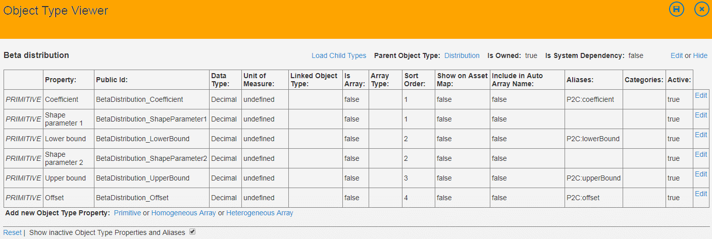

### AMS Functional Overview

The main function of AMS is to manage and allow for editing of model inputs and to allow user to create (P2C) submissions.

Values, that are used as model inputs, are organized into a structure called **state**.

States are used as input states for cases. **Case** (model case) binds together an input state and model version. Users create submissions for cases - they specify model run configuration (submission parameters) and number of seeds (packages) in the submission.

Cases are further grouped into **scenarios** and scenarios are grouped into **projects**.

To summarize this hierarchy:

* projects have many scenarios
* scenarios have many cases
* case has one input state
* case can have many output states (however, this feature in not being used)
* case has one model version
* case has one or more model submissions (usually one)
* submission has many seeds (packages)

> Output states in AMS were supposed to hold "important" model outputs and AMS was supposed to provide basic comparison of input state and output state(s). This functionality was never implemented in AMS.

#### Management and editing of model inputs

##### Project hierarchy browsing and editing

AMS provides browse and edit screens for all entities of the hierarchy as listed above.

<!--  -->

<!--  -->

Users can create instances of all these entities "manually" using edit screens or they can upload their definitions using Excel spreadsheet upload.
States can be also upload from Excel spreadsheet.
Excel spreadsheet upload also allows user to create model submissions.

##### Bulk upload for scenarios, cases, submissions and states

<!--  -->

<!--  -->

##### Change sets

AMS supports a special kind of state - **change set**
Change sets are not used as model inputs. Instead they can be "applied" to another states changing (replacing or removing) their content.
<!--  -->

Change sets creation and "application" can be also done via Excel spreadsheet upload.

##### State summary

State values can be edited directly in AMS.

The "State Summary" screen is a general-purpose editing tool for editing of "atomic" values.

<!--  -->

##### Case setup tool

Another tools that was supposed to work across all value structures is Case Setup Tool. The main idea behind this tool is to a way to generate new states from a selected base state where only selected values will be modified in a specified way in the new states.
This, however, currently does not work for nested values (see object type system bellow) and this tool is being replaced with a new version.

<!--  -->

##### Specialized tools for state editing

AMS also contains a collection of specialized tools that are used for editing of standardized data structures frequently occurring in states.

These tools are:

* Stockyard Layout Editor - as the name says, this is used for editing of stockyard definitions
* Outage Plans Editor - editing of outage plans and maintenance plans
* Marine Paths Editor
* Mine Port Sequence Editor
* Marine Paths Editor

<!--  -->

All these specialized tools rely on parts of state being organized in a specific way - the values must be organized using specific object types and properties (see object type system description later in this document).

##### Case Matrix

Case Matrix is a tool that allows user to easily create new cases, set their input states and execute them (create submissions and push them to Runs Controller) in bulk.

##### Asset Maps

Asset Maps allow user to easily see most important values in their state. It can not only display atomic values but also calculated values.

It displays state objects and their values (including calculated values) in layout defined by user.

Asset maps are fully configurable by the user.

##### State Validation

* [ ] TODO: describe and attach screenshot

##### State Comparison

* [ ] TODO: describe and attach screenshot

##### Actual Data Import

* [ ] TODO: describe and attach screenshot

#### Object type system

Values in AMS are organized within states into hierarchies.
Structure (schema) of the hierarchy is defined using object type system.

##### Introduction to AMS object type system

The AMS object type system design was inspired by object-oriented design.

Elements of the object type system are:

* object types
* properties
* property options (if property represents an enumeration of possible values)
* object type properties
* data types
* units of measures

Each value in AMS has to "belong" to an object.
Objects are "instances" of object types (e.g. "Car Dumper 1" is an instance of the "Car Dumper" object type).
Each object type has a list of object type properties (e.g object type "Car Dumper" has object type properties "Car Dumper Net Rate", "Car Dumper Throughput" etc.).
Each object type property references a property. Property represent a well-known term that can be used for multiple object types (e.g. object type property "Car Dumper Net Rate" references property "Net Rate". Property "Net Rate" is also used for other types of equipment.)

Each value then references an object and an object type property.
> In fact there is a separate entity that represents this relationship called object property. This entity is technically not needed anymore but remains in AMS for historical reasons.

Object types in AMS represent various equipment types, nested data structures (e.g. distributions), model configuration that needs to be a part of an input state etc.

There are two categories of object types in AMS:

* "Not-owned"
* "Owned"

Object type is **not-owned** if its instances (objects of this type) need to have an identity (e.g. car dumpers need to have an identity - unique identifier - so that they can be tell apart). These object with identity (not-owned objects) are sometimes called top-level objects because in state summary they are at the top of the hierarchy.

Object type is **owned** if its instances don't have to (or can't) have an identity (e.g. distribution objects don't have to have an identity, because distribution objects are always used as a values of some object type property.) Owned objects are always used as values of some object type property. It can be a property of not-owned or owned object, but there always is a "parent" for such object. These objects are "nested" in the hierarchy.

Another feature of AMS object type system is a support of inheritance of object types.
An object type can be used as a parent for another object type(s). This derived type then "inherits" object type properties of its parent.

AMS also supports arrays. All arrays in AMS are arrays of objects. These object can be not-owned (then it's really an array of object references) or owned (and then owned objects are really nested in the array with all their values). Arrays are either defined as homogeneous (all elements are of the same object type (or have same parent object type)) or heterogeneous (array elements can be of various types).
Array elements have 1-based indices.

##### Maintenance of object type system

AMS users have an option to create new or change existing

* object types
* object type properties
* properties
* property options
* units of measure

> object properties are created automatically
> data types are fixed and cannot be modified

There are standard browse and edit screens for all entities listed above.

There is also a special Object Type Viewer/Editor available in AMS.

<!--  -->

#### Knowledge Items

* [ ] TODO: describe and attach screenshot

#### Control Framework Configuration

#### Model Versions

#### Submission Progress

#### Type System Versions

#### Merging States using Modules

#### Other Reference Data

* Customers
* Project Types

#### Navigation

* Dashboard
  * overview of queued, running and recently finished submissions with links to Runs Controller web site for current user and all users
  * navigation to main browse screens (projects, scenarios, cases and states)
  * navigation to bulk import screens (states and submissions)
  * navigation to user's favorite entities
* Browse screens for main entities (Projects, Scenarios, Cases, States)
* State validation

#### Hangfire (AMS Service) Functional Overview

### Runs Controller Functional Overview

This is functional overview