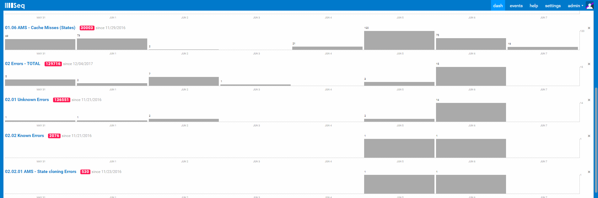
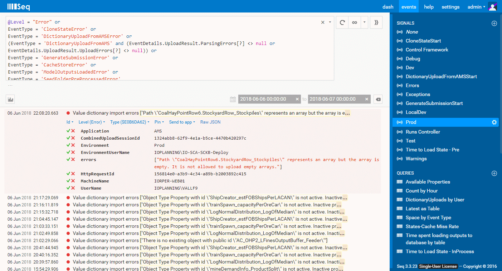
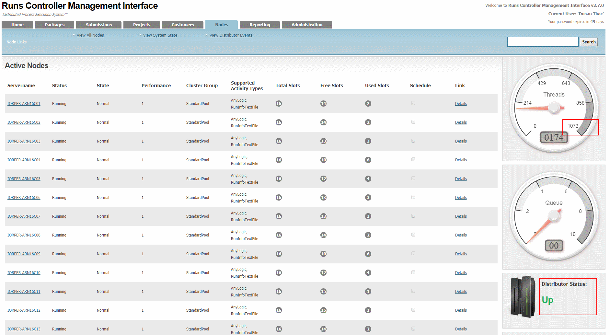
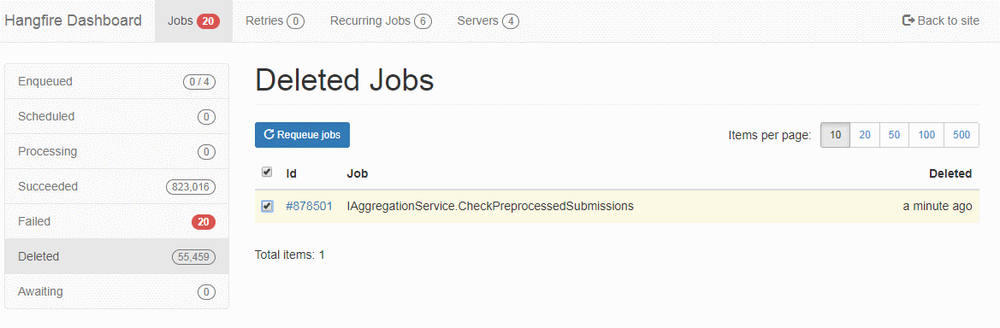

### Monitoring

#### Errors

Most AMS and Runs Controller components create log entries using [Serilog](https://serilog.net/) and send them to Seq(https://getseq.net/) instance.

Our Seq instance URL is [http://iorper-webd01:5341/#/dash](http://iorper-webd01:5341/#/dash).

The Seq dashboard provides and overview of logged errors and other important events.

<!-- -->


By clicking on a dashboard chart you can navigate to the events screen and see filtered events.

<!-- -->


Errors monitoring should be done daily.

Seq also stores other event types, not just errors. These logged events can be invaluable when investigating some issues.

#### Runs Controller status

Another daily task is to check availability of Runs Controller clients.

Runs Controller Portal Nodes screens lists active, inactive and decommissioned nodes (clients).
If client becomes inactive it usually means there are technical issues on the machine that need to fixed.

Number of threads displayed on the dial in the top-right corner is another useful indicator.

This screen also displays distributor status.

<!-- -->


Runs controller distributor and clients still use event log for most of their logging.
In some cases it may help to have a look at logged events when investigating Runs Controller issues.

#### Hangfire Queue

Hangfire also requires regular monitor.

Occasionally, most often in Test environment, job gets stuck and blocks processing queue.
The stuck job needs to be deleted; sometimes, if the queue has grown too long; the enqueued jobs need to be deleted too.

The Hangfire Windows Service may need a restart.

Recently deleted jobs can then be re-queued.

<!-- -->


#### Database sizes

All database sizes and their growth should be regularly checked to avoid running out of space.

#### Configuration

Following documents list and explain configuration of AMS and Runs Controller main components (BHP Billiton account required to sign in to SharePoint):

* [AMS Deployment and Configuration](https://spo.bhpbilliton.com/:w:/s/WAIOFLISCA/Eb5PqpC0fiBLqz7sMwdUo64BczSPCoPSKmtkdL9N5aQJQw)
* [Runs Controller Deployment and Configuration](https://spo.bhpbilliton.com/:w:/s/WAIOFLISCA/EW8RUIX5IOdNgpNXym7bm8MB492FgA4Dgd6et90vh1UNxQ)
* [Runs Controller Reporting API Deployment and Confuguration](https://spo.bhpbilliton.com/:w:/s/WAIOFLISCA/Ebuf3OrtIcNLnrgIXcBhBE0BtM3_znLzj8DLHQ_dCrLmrw)

### Previous errors and problem solving

#### Background processing in Hangfire stopped and users were not able to create submissions

In Seq there were errors logged when users tried to create submissions:


**Error text:**
```
ScheduleSubmissionCreationInRunsControllerFailed
```
**Exception:**
```
Hangfire.BackgroundJobClientException: Background job creation failed. See inner exception for details. ---> System.Messaging.MessageQueueException: Insufficient resources to perform operation. at System.Messaging.MessageQueue.SendInternal
```

**Route cause:**

Hangfire uses MSMQ for creation and scheduling of background jobs.

For production these message queues are configured on IORPER-WEB01.

There are multiple message queues used - all private and originally with journal messages enabled.
Journal messages were not being processed and their number grew to an extent where it prevented further message creation.

When MSMQ windows service was stopped it could not be restarted.
The error (when trying to start the MSMQ service) was:
```
The Message Queuing service terminated with the following service-specific error: 
%%3222143985
```

**Resolution:**

> Warning: This approach removes all unprocessed messages from all queues.

Based on [Unable to start Message Queuing service: “The Message Queuing service terminated with service-specific error %%-1072823311”](http://www.mikerodionov.com/2016/02/the-message-queuing-service-terminated-with-service-specific-error-1072823311/)

* Stop MSMQ service.
* Delete all files (*.mq and QMLog) from the C:\Windows\System32\msmq\storage folder.
* Change registry value \\HKEY_LOCAL_MACHINE\SOFTWARE\Microsoft\MSMQ\Parameters\LogDataCreated to 0.
* Start MSMQ service.
* Disable journal messages for Hangfire queues
